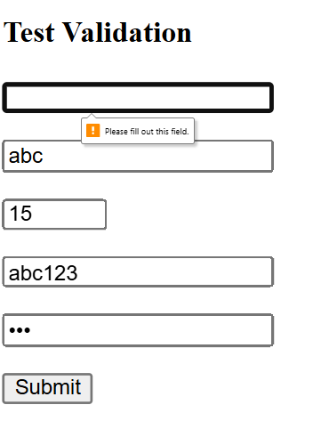

PHẦN A — KIỂM TRA ĐỌC HIỂU
Câu A1 — Input Types
   - type="email" → Ô nhập text, kiểm tra có @ và domain → Dùng cho đăng ký tài khoản
   - type="password" → Ô nhập ẩn ký tự → Dùng cho đăng nhập / đặt mật khẩu
   - type="number" → Ô nhập số có nút tăng giảm → Dùng nhập số lượng sản phẩm
   - type="tel" → Ô nhập số, mobile hiện bàn phím số → Dùng nhập số điện thoại giao hàng
   - type="date" → Có lịch chọn ngày → Dùng chọn ngày giao hàng
   - type="file" → Nút upload file → Dùng upload ảnh đánh giá sản phẩm
   - type="radio" → Chọn 1 trong nhiều lựa chọn → Dùng chọn phương thức thanh toán
   - type="checkbox" → Chọn nhiều hoặc bật/tắt → Dùng đồng ý điều khoản / chọn nhiều sản phẩm
   - type="range" → Thanh kéo (slider) → Dùng lọc giá sản phẩm (price range)
   - type="search" → Ô tìm kiếm có nút xoá nhanh → Dùng tìm kiếm sản phẩm
Tài liệu tham chiếu: tuan_1_html5/07_forms_interactive.md
Câu A2: 
  <!-- Trường hợp 1 -->
  <input type="text" required value="">   <!-- User để trống -->
     Không submit được vì: required + giá trị rỗng → vi phạm valueMissing
  <!-- Trường hợp 2 -->
  <input type="email" value="abc">        <!-- User gõ "abc" -->
     Không submit được
     Vì: type="email" yêu cầu format có @ → "abc" sai
  <!-- Trường hợp 3 -->
  <input type="number" min="1" max="10" value="15"> <!-- User gõ 15 -->
     Không submit được
     Vì 15 > max=10 → vi phạm rangeOverflow

   <!-- Trường hợp 4 -->
   <input type="text" pattern="[0-9]{10}" value="abc123"> <!-- User gõ "abc123" -->
     Không submit được
     Vì : pattern yêu cầu đúng 10 chữ số, nhưng "abc123" không match
   <!-- Trường hợp 5 -->
   <input type="password" minlength="8" value="123">  <!-- User gõ "123" -->
     Không submit được
     Vì: độ dài = 3 < 8

    
    So sánh kết quả thực tế với dự đoán: 
    Kết quả thực tế thu được
      Browser hiển thị lỗi: “Please fill out this field.”
      Focus nằm ở input đầu tiên
      Các field phía dưới chưa bị kiểm tra
      Form không submit
    Kết quả thực tế trùng khớp 100% với dự đoán
      Tất cả input đều sai nhưng:
      Browser chỉ báo lỗi từng cái một
      Ưu tiên lỗi đầu tiên trong form
Câu A3:
   1: <label for="email"> quan trọng với screen reader vì
    Vì nó liên kết tên (label) với ô input
         <label for="email">Email:</label>
         <input type="email" id="email">
    Người dùng bình thường thấy chữ “Email” sẽ biết phải nhập gì
    Với screen reader:
         Nó sẽ đọc: “Email, edit text”
         Người khiếm thị hiểu ngay đây là ô nhập email
    Nếu KHÔNG có label:
        <input type="email"> Screen reader chỉ đọc: “edit text”
       Người dùng không biết phải nhập gì dẫn đến gần như không dùng được form
   2: Khi nào dùng <fieldset> + <legend>
    Dùng khi có nhiều input liên quan cùng 1 nhóm
    Ví dụ: 
    <fieldset>
         <legend>Giới tính</legend>
         <label>
            <input type="radio" name="gender" value="male"> Nam
        </label>
        <label>
            <input type="radio" name="gender" value="female"> Nữ
        </label>
    </fieldset>
 Người bình thường: Thấy nhóm “Giới tính” sẽ hiểu context
    Screen reader:
         “Giới tính, group”
         “Nam, radio button”
    Người dùng hiểu các lựa chọn này thuộc cùng 1 câu hỏi

     Nếu không dùng:
         Screen reader chỉ đọc từng radio riêng lẻ
         Không biết chúng thuộc cùng nhóm sẽ rất khó hiểu
     Khi nên dùng: Radio buttons, Checkbox nhóm
        Thông tin địa chỉ / thanh toán
   3: aria-label 
    Dùng khi không có label hiển thị nhưng vẫn cần tên cho screen reader
     Ví dụ:
   <button aria-label="Tìm kiếm">tìm kiếm</button>
    Người bình thường:
      Thấy chữ tìm kiếm là hiểu
    Screen reader:
      Đọc: “Tìm kiếm button”
 Tại sao KHÔNG nên dùng aria-label khi đã có <label>
 Vì:
 1. Bị trùng / ghi đè
    Screen reader có thể sẽ đọc 2 lần hoặc chỉ đọc aria-label và bỏ label thật
2. Vi phạm nguyên tắc accessibility
 Ưu tiên: Native HTML > ARIA
         <label> luôn tốt hơn aria-label
3. Khó maintain
   <label>Email</label>
   <input aria-label="Nhập email của bạn">
 2 nội dung khác nhau → dễ gây lỗi UX

 Câu A4:
   1: Thuộc tính loading="lazy" trên thẻ .
    loading="lazy" giúp trì hõa việc tải ảnh cho đến khi ảnh gần xuất hiện trên màn hình.
    Giúp cải thiện:
      - tăng tốc độ tải ban đầu
      - giảm băng thông 
      - cải thiện hiệu năng
    Không nên sử dụng khi:
      - cần ảnh hiển thị ngay khi mở trang
      - sử dụng với những ảnh quan trọng như logo, banner
   2: <video> cần nhiều <source>
    Vì:
      - Mỗi browser hỗ trợ fomat khác nhau
      - Browser sẽ tự chọn fomat phù hợp
      - Tránh lỗi video không phát được
    3 format vidoe phổ biến
      - MP4: phổ biến nhất, hỗ trợ rộng
      - WebM: nhẹ, open-source
      - Ogg(OGV): ít sử dụng hơn
   3: Thuộc tính alt trên 
    Giúp:
      - Screen reader mô tả ảnh cho người khiếm thị 
      - Hiển thị khi ảnh không load
      - Hỗ trợ SEO
    Alt cho từng trường hợp:
    - Ảnh sản phẩm ip16 
        
        + mô tả sản phẩm
        + có màu và góc nhìn
    - Ảnh trang trí
        
        + dùng alt rỗng tránh gây nhiễu thông tin
    - Biểu đồ doanh thu 
        
Câu A5:
   Cách 1 
        Dùng khi:
          - ảnh độc lập không cần chú thích
          - chỉ mang tính chất minh họa cơ bản đơn giản
          - nội dung đã có từ context xung quanh
        VD: 
          - 
          - 
Tiệm bánh vừa ra mắt món bánh mới

           
    Cách 2
       <figure>
          
          <figcaption>iPhone 16 Pro Max — 25.990.000đ</figcaption>
       </figure>
       Dùng khi: 
         - Ảnh cần chú thích rõ ràng
         - Caption là phần nội dung quan trọng
         - Muốn nhóm ảnh + mô tả thành 1 đơn vị semantic
       VD:
       - Trang sản phẩm
        <figure>
          
          <figcaption>Nike Air Force 1 — 2.500.000đ</figcaption>
        </figure>
       - Ảnh trong bài báo
        <figure>
         
         <figcaption>Hình 1: Doanh thu tăng 30% trong năm 2026</figcaption>
        </figure>

Phần C - Phân tích và suy luận
Câu C1:
  - Lỗi 1: Dòng 2 — Input "Tên" không có <label for> Vi phạm accessibility
    Sửa:  <label for="name">Tên:</label>
          <input type="text" id="name" name="name" required>
  - Lỗi 2: Dòng 4 — Input email không có <label> sai best practice
    Sửa:  <label for="email">Email:</label>
          <input type="email" id="email" name="email" required placeholder="Email của bạn">
  - Lỗi 3: Dòng 6-7 — Password không có label screen reader không phân    biệt được 2 ô
    Sửa:
<label for="password">Mật khẩu:</label>
<input type="password" id="password" name="password" required minlength="8">
<label for="confirm">Nhập lại mật khẩu:</label>
<input type="password" id="confirm" name="confirm" required minlength="8">
  - Lỗi 4: Dòng 6-7 — Không có validation cho password  Thiếu required, minlength
     Đã sửa bên trên
  - Lỗi 5: Dòng 9 — Phone dùng type="text" Không đúng semantic
  Sửa:
<label for="phone">Số điện thoại:</label>
<input type="tel" id="phone" name="phone"
       pattern="[0-9]{10}" placeholder="0901234567">
  - Lỗi 6: Dòng 9 — Dùng value thay vì placeholder  UX sai
  Sửa: (đã đổi thành placeholder ở trên)
  - Lỗi 7: Dòng 11 — <select> không có label  Accessibility fail
  Sửa:
<label for="city">Thành phố:</label>
<select id="city" name="city">
    <option value="">-- Chọn --</option>
    <option>Hà Nội</option>
    <option>TP.HCM</option>
</select>
  - Lỗi 8: Dòng 16 — Checkbox không có input Label không gắn với checkbox không click được
<label>
    <input type="checkbox" name="agree" required>
    Tôi đồng ý điều khoản
</label>

Câu C2:
   1: pattern regex cho CMND/CCCD và Số tài khoản
    - CMND/CCCD: pattern="[0-9]{12}"
    - STK: pattern="[0-9]{10,15}
   2: HTM5 validation chưa đủ an toàn cho ngân hàng vì HTML validation chạy trên trình duyệt (client-side) Người dùng có thể:
    - Tắt validation (novalidate)
    - Sửa HTML bằng DevTools
    - Gửi request trực tiếp 
    HTML5 validation chỉ giúp cải thiện UX, không phải cơ chế bảo mật.
Mọi dữ liệu quan trọng trong ứng dụng ngân hàng bắt buộc phải validate ở backend.
  
  3: 3 loại validation HTML5 KHÔNG làm được
    + So sánh giữa các field
Ví dụ:
Confirm PIN = PIN
Ngày bắt đầu < ngày kết thúc
    + Logic nghiệp vụ (business logic)
Ví dụ:
Số tài khoản phải tồn tại trong hệ thống
CMND không được trùng người khác
    + Validation phức tạp / động
Ví dụ:
Kiểm tra email đã đăng ký chưa
Kiểm tra OTP
Rule thay đổi theo server
  4: 2 rủi ro nếu chỉ validate Frontend
     1. Bypass validation → nhập dữ liệu sai/độc hại
Gửi request trực tiếp (Postman)
Bỏ qua mọi rule HTML sẽ dẫn đến dữ liệu sai trong database, lỗi hệ thống
     2. Tấn công bảo mật (Injection, spam)
Ví dụ:
SQL Injection
XSS
 Vì backend không kiểm tra → dữ liệu độc hại được xử lý

